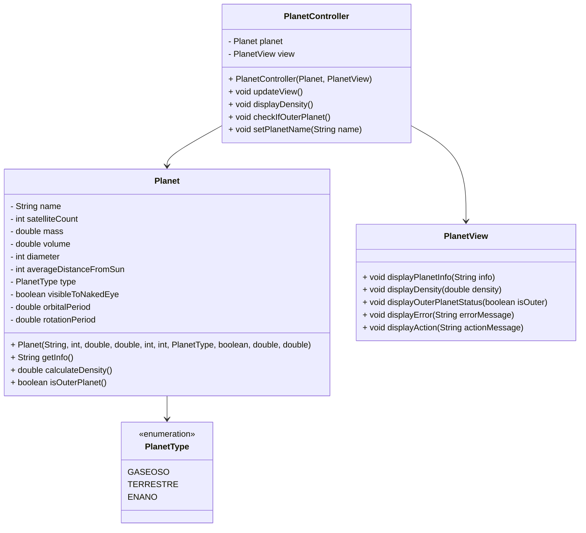

# Solar System: Planet Model

This project implements a model of planets in the solar system using the **Model-View-Controller (MVC)** design pattern. It includes functionalities to represent planet attributes, calculate its density, and determine if it is an outer planet.

## Project Structure

The project follows the MVC architecture, where:

- **Model (Planet)**: Represents the planet's data and logic, including attributes like name, mass, volume, and type. It also contains methods to calculate density and determine if a planet is outer.
- **View (PlanetView)**: Handles the display of planet information to the user.
- **Controller (PlanetController)**: Connects the Model and View, managing the logic and user interactions.

### Class Diagram

### Test coverage

